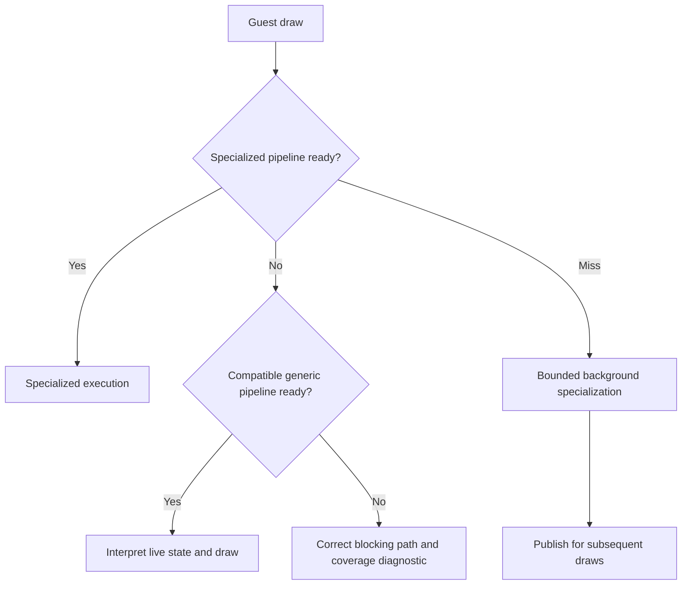

# Uberhar architectural review — 2026-09-24

<!-- AstraEH: Source audit, evidence analysis and target design. Proposed stages
below are not implemented merely by documenting them. -->

## Decision

Build toward **fallbacks ready before a draw needs them**, with guest rendering
state interpreted as data and specialized host programs compiled in the
background. The current on-demand TEV fallback is a useful correctness prototype,
but its architecture cannot guarantee smooth first encounters. Improving its
compiler input alone is insufficient.

Use a small set of generic fragment families, a vertex-processing fallback, and
a capability-dependent strategy for Vulkan pipeline state. Bound compilation
work and measure both fallback coverage and real frame delivery. Optimized
programs should replace generic execution during the same first playthrough;
later playthroughs additionally benefit from persisted history and driver caches.

This review covers 0.0.6, source
`9be1cd41068029a253412f1430562f3081c8e52b`, and the owner's complete Awakening log
`uberhar_log_9_24_0423_FEA.txt`. It does not establish a hardware performance result
for any proposed implementation. Repeat this review at the cadence in
[the ledger](UBERHAR_REVIEW_CADENCE.md), normally after 0.0.10.

## Evidence and limits

The supplied device is Adreno 740 with Qualcomm 512.676.53, Vulkan 1.3.128. Both
sessions use hybrid TEV, forced TEV off, 2x resolution, asynchronous compilation
and presentation, SPIR-V generation on and frontend optimization off.

| Measurement | 0.0.5 cold | 0.0.6 cold | 0.0.6 warm |
| --- | ---: | ---: | ---: |
| Draw requests | 193,452 | 183,418 | 179,692 |
| Scheduler pipeline waits | 206 | 138 | 0 |
| Total scheduler wait | 29.128 s | 18.849 s | 0 s |
| Longest wait | 1,101.304 ms | 1,042.670 ms | 0 ms |
| Waits at least 50 ms | 115 | 71 | 0 |
| Fallback pipelines built | 51 | 52 | 0 |
| Fallback driver-call wall time | 24.113 s | 10.076 s | 0 s |
| Draws served by fallback | 149 | 161 | 0 |

The cold total fell 35.3%, but the runs reached different workloads: 0.0.6 had
5.2% fewer draws and 314 rather than 404 specialized pipeline builds. The change
is encouraging, not a controlled speedup measurement. The warm run had no newly
pending specialized draws and no pipeline waits, consistent with the owner's
report. The prior 0.0.5 warm run included different gameplay and is not a matched
baseline. Fast forward does not create a separate cache; different gameplay can
encounter different states.

Only **9 of 52** completed 0.0.6 fallback pipelines served a draw. The other 43
accounted for **8.960 s**, 88.9% of fallback driver-call wall time. Concurrent
worker durations overlap each other and scheduler waits: removing an unused
pipeline does not imply subtracting its whole duration from gameplay stalls.
Fallback GLSL/module work totaled only 0.259 s. Driver pipeline creation, utility
and readiness are higher priorities than shaving a few more GLSL-generation
milliseconds. Small VS wait time does not mean VS identity is unimportant: it
still multiplies distinct pipelines.

## What the source actually does

`vk_pipeline_cache.cpp` captures TEV registers as 100 bytes of push constants,
zeros those fields in a fragment-family key, and retains all other FSConfig
state. A fallback reuses the current specialized VS and GS and the entire
fixed-function pipeline configuration. A dedicated serial worker compiles the
fragment module and its Vulkan pipeline on demand. Normal hybrid mode admits one
unfinished fallback job, retains up to 128 shader families and 1,024 pipelines,
and also queues the specialized pipeline. The scheduler selects the first usable
result and preserves the draw; unsupported states take the accurate specialized
route. The fallback maps are per title and are neither persisted as generic
recipes nor prepared as a complete library at startup.

0.0.6's compact six-stage loop, lazy texture reuse and restored driver optimization
remain useful. Forced TEV stays on generic execution for correctness comparisons;
its sustained frame rate is not the normal hybrid performance target.

`vk_shader_disk_cache.cpp` already reconstructs observed programs and pipelines
at startup. It generates vertex GLSL synchronously on a new VS configuration,
then schedules frontend compilation. Different configurations can share generated
vertex code while retaining different configuration IDs in pipeline keys. This
is a candidate for a separate canonical execution key, with disk identity intact.

Another candidate is vertex-layout hashing: inactive binding-array tails can
remain in the key even though pipeline creation uses only active entries. Neither
candidate should be normalized without proving the effective interface and
state remain identical.

## First implementation: eliminate proven fragment-key redundancy

A host probe of the production generator found distinct raw family hashes with
byte-identical GLSL for native sampler wrap choices, native blend factors,
inactive logic operations and fog orientation when fog is disabled. This is a
source-level finding; the supplied log cannot tell us how often those aliases
occur in Awakening.

0.0.7 should canonicalize only these shader-irrelevant fields after applying the
device profile. Native sampler and blend behavior must remain in their normal
Vulkan state: equal fragment programs do not imply equal complete pipelines.
Canonicalization must be idempotent, preserve active emulated border behavior,
and leave shader-affecting lighting, alpha, fog and texture interfaces distinct.
Do not change transferable FSConfig layout or specialized cache identity.

Add a bounded census of candidate raw/canonical fragment families and pipeline
dimensions at fallback requests. Count candidates before admission, not just
successful builds, and identify capped observations. Together with used/unused
pipeline timings, this determines where the next reduction has practical value.
Warm draws with ready specializations should incur no census work.

## Target execution model

The target is to make the missing-generic branch rare, then absent within a
declared coverage set. It remains visible and correct until coverage is proven.
No draw skipping, stale framebuffer reuse or approximate lighting is an acceptable
substitute for readiness. This goal removes shader-related blocking; it cannot
promise to remove unrelated I/O, emulation, driver or presentation stalls.

### Generic fragment programs

Move inexpensive controls such as alpha test, fog, scissor and depth conversion
into runtime data, followed by lighting selectors/enables and procedural texture
controls. Keep a small number of families where resource types or a costly
feature materially change GPU resource use, for example unlit, lit and procedural
texturing. A single enormous shader may raise register pressure even when its
uniform branches skip most work.

Preserve exact TEV rounding, stage ordering, buffer updates, texture semantics and
precision. AddSigned remains excluded: existing references disagree at rounding
boundaries, and software texturing itself has accuracy TODOs. Do not resolve that
by simply choosing the most convenient reference. Use directed comparisons among
GLSL, SPIR-V, software execution and hardware captures where available.

The current push-constant ABI has only the TEV words and buffer mask. A broader
interpreter needs an explicit versioned uniform/storage-buffer ABI with a small
push-constant offset, alignment checks and per-draw data retained until its GPU
work completes. Typed 2D/cube/shadow resources require compatible declarations
and valid bindings; runtime flags cannot change a sampler's declared type.

Predecode register instructions, selectors and invariant constants when their
state changes. Preserve needed derivatives and avoid speculative texture work.
Pixel results usually cannot be precomputed because textures, geometry, camera
and lighting change. Cache transformed vertices only with complete program,
uniform and source-buffer version tracking, not by vertex index alone.

### Vertex fallback

The existing PICA CPU path already processes vertices and geometry and emits
triangles through a fixed software vertex layout and trivial host VS/GS. This is
the lowest-risk bridge for avoiding dependence on a newly compiled specialized
GPU VS. It still requires a compatible ready fragment and fixed-state pipeline.

The ARM64 CPU shader engine normally JIT-compiles a new program, so this bridge
is not automatically compilation-free. Benchmark its existing interpreter as an
immediate path and the JIT as an optimization. Any background JIT must own an
immutable program snapshot and isolated compiler state. Choose the CPU route
before submission; use an explicit result contract to guarantee exactly one draw
and avoid partial GPU submissions followed by retries.

Longer term, a precompiled GPU vertex interpreter can read guest instructions,
swizzles and uniforms as data. Prototype normal VS coverage before programmable
geometry. Indirect indexing, loops/calls, register preservation, PICA precision
and special arithmetic behavior need differential tests. Do not cap a loop and
silently return wrong geometry; route unsupported control flow safely before
dispatch. GPU branch and register costs must be measured on Adreno.

### Vulkan pipeline state is a separate problem

On this driver, the current code explicitly blacklists extended dynamic state.
Topology, culling, depth and stencil therefore remain static pipeline dimensions;
blend operations, write masks and attachment formats also matter. Preserve that
workaround until a focused device test justifies a change.

| Route | Benefit | Constraint / decision |
| --- | --- | --- |
| Bounded ready pipeline bank | Works with existing pipeline model | Needs measured state breadth; blind Cartesian enumeration is too large |
| Graphics pipeline libraries | Reuse independently compiled stages/state | Query support and fast-linking property; availability on Thor is unverified |
| Shader objects plus required dynamic state | Can reduce monolithic pipeline combinations | Optional capability, driver validation and substantial binding work; shader creation still compiles |
| CPU vertex bridge | Removes guest VS/layout variation from generic GPU path | CPU cost and remaining fragment/fixed-state coverage |
| Full compute/tile renderer | Can interpret much more of raster state in one program | Major new rasterizer: ordering, depth/stencil, blending, derivatives, precision and bandwidth |

Khronos defines fast library linking without link-time optimization as comparable
to command recording **when** the device reports `graphicsPipelineLibraryFastLinking`.
This is worth probing, not assuming. Log advertised, enabled and blacklisted
capabilities separately. The current log does not query graphics pipeline
libraries or shader objects, so their absence from it proves nothing.

Without a suitable extension, prepare a bounded generic pipeline bank before
gameplay and report uncovered combinations honestly. Persistent per-title history
improves later starts; a device-wide generic bank is required for genuinely new
content. If static-state breadth makes full coverage impractical, reassess the
compute/tile route rather than claiming fragment interpretation solves it.
Unsynchronized framebuffer read/modify/write in fragments is not a safe shortcut
for blending and depth ordering; fragment interlock is unavailable in this log.

## Compilation and persistence

Use a shared compilation budget with demand priority. Count queued, running,
completed-but-unused and reused work. A ready generic path allows specialized
work to be delayed or deprioritized when emulation lacks CPU headroom. Do not
start more compiler threads merely because a queue exists; current shader,
pipeline and fallback workers can compete with emulation and with driver locks.

The shared VkPipelineCache is internally synchronized. Per-worker caches merged
at quiescent points are an experiment for lock contention, not an established
fix. Never enable external synchronization flags without actually serializing
all required access. Record driver cache-hit feedback only when the extension and
valid feedback bits support it. Worker wall time is not CPU usage or lost frames.

Package prevalidated generic SPIR-V where practical; this removes runtime
frontend work, not the device driver's native compilation. Prepare native generic
pipelines at an explicit startup stage and persist compatible results. Cache keys
need generator/ABI version, device and driver compatibility, pipeline-cache UUID,
enabled feature profile and relevant attachment/interface information. Publish
completed immutable objects with proper lifetime/fence handling; retain accurate
fallbacks on failure. Avoid unbounded per-game or global memory growth.

Scanning a ROM cannot enumerate all runtime register combinations or driver-native
pipelines. It can find some static guest programs as optional hints, but cannot
replace generic coverage or normal cache loading. Moving useful generic
preparation to startup is honest; describing all compilation as eliminated is not.

## Ordered milestones and acceptance gates

| Stage | Deliverable | Gate before advancing |
| --- | --- | --- |
| 0.0.7 foundation | Canonical fragment families; bounded variant census | Identical generated source for merged states, active-state separation, existing numerical/module/package gates |
| Coverage and preparation | Dynamic cheap fragment controls; versioned ABI; startup generic bank; capability queries | No compile-on-draw for declared fragment coverage, finite startup/memory budget, unchanged output |
| Vertex independence | CPU vertex/interpreter bridge and fixed layout | Correctness across indexed draws and geometry; no duplicate/lost draws; measured cold frame-time improvement |
| Pipeline strategy | Capability-selected libraries/dynamic state or measured ready bank | Driver-validated state transitions; coverage and startup cost reported per device |
| GPU execution and scheduling | GPU VS interpreter prototype; demand-based compiler budget | Better sustained frame times and thermal behavior without precision regressions |
| Presentation follow-up | Paired top/bottom frame identities and delivery tracing | Distinguish emulated frame pairing from two Android surfaces' physical scanout |

Stages may need multiple alpha builds. Do not promise one stage per version.
Model clarity follows correct sampling, resolution and rendering validation;
sharpening is not a shader-compilation fix. Display synchronization stays on the
roadmap after a useful first-playthrough path, as requested.

Each device comparison should retain the same driver/settings and replay the same
normal-speed section cold and warm. Clear caches only before the cold run, record
startup separately, and compare hybrid off/on. Test forced mode separately for
correctness; test 4x resolution and fast forward separately for headroom. Repeat
captures to expose variance and thermal throttling. Reducing 4x to 2x reduces
internal pixel count to roughly one quarter, not total emulation cost or driver
compile time by that factor.

Track p50/p95/p99 frame intervals, long stalls, pipeline blocking, fallback coverage
and utility, queue latency, startup duration, memory and sustained throughput.
The current log supports pipeline timing, not all these frame/GPU metrics. Add
presentation frame IDs and supported GPU timestamps as separate instrumentation;
do not infer GPU time from CPU completion counters. A first-playthrough gate is
zero compilation waits within a declared coverage set and no visual regressions,
followed by broader game/device coverage. Warm performance must remain close to
the specialized baseline. Define budgets from controlled captures rather than
inventing a frame-rate prediction.

Host validation includes source equivalence, adversarial non-equivalence,
idempotence, full Vulkan modules, exact numerical TEV comparisons and concurrency
tests where scheduling changes. Current Mesa tests use synthetic textures and
cannot prove Adreno correctness, real derivatives or whole-game equivalence.
Android builds retain manifest, ABI, native-library, signing continuity and
installation gates. Start CI and hand off its link instead of waiting in chat.

## Primary references

- [Dolphin's ubershader design](https://dolphin-emu.org/blog/2017/07/30/ubershaders/):
  ready generic execution with background specialization, and the limitations of
  shader prediction and draw skipping.
- [Khronos graphics pipeline library sample](https://docs.vulkan.org/samples/latest/samples/extensions/graphics_pipeline_library/README.html)
  and [fast-linking property](https://docs.vulkan.org/refpages/latest/refpages/source/VkPhysicalDeviceGraphicsPipelineLibraryPropertiesEXT.html).
- [Khronos shader object proposal](https://docs.vulkan.org/features/latest/features/proposals/VK_EXT_shader_object.html):
  a different binding model, still with shader creation/compilation.
- [Pipeline cache synchronization flags](https://docs.vulkan.org/refpages/latest/refpages/source/VkPipelineCacheCreateFlagBits.html),
  [creation feedback flags](https://docs.vulkan.org/refpages/latest/refpages/source/VkPipelineCreationFeedbackFlagBits.html),
  and [device limits](https://docs.vulkan.org/refpages/latest/refpages/source/VkPhysicalDeviceLimits.html).

Source audit anchors: `vk_pipeline_cache`, `vk_graphics_pipeline`,
`vk_shader_disk_cache`, `vk_rasterizer`, `vk_instance`, PICA `pica_core`, CPU
`shader_jit`/`shader_interpreter`, and GLSL/SPIR-V fragment generators. External
designs motivate options; Uberhar source and the owner's captures establish the
current implementation and observed behavior.
