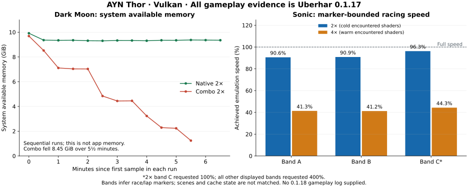

# 0.1.17–0.1.18 device evidence and the next comparison

<!-- CodexAstraUlt: October 5, 2026 EDT / October 6 UTC review. Distinguish owner observations, recorded measurements, reproduced host defects and proposed device checks. Raw owner logs and game data are not included in this repository. -->

**Android classifies both recorded exits as low-memory exits.** The retained
0.1.17 Dark Moon Combo run also shows severe slowdown and a large loss of system
available memory. This strengthens the memory-pressure lead, but neither identifies
an allocation owner nor proves the graphical corruption and termination share a
cause. The owner reports essentially unchanged corruption in 0.1.18 and a return
to the app menu. The supplied 0.1.18 records contain no gameplay body, so that
behavior cannot be attributed to its renderer-exception handler from these files.

## Input provenance

<!-- CodexAstraUlt: Deduplicate by bytes and assign builds from content rather than filenames. Source line references below use these labels. -->

Seven attachments contain **six unique files**. `Sonic` and its `(1)` copy are
byte-identical. All recorded gameplay is build
`fe7d1b8a0b395229ca34ab79e14a005cedd4411e` (**0.1.17**). `Startup` and `Exit18`
identify `27b4ccbd8e18fedd630700a31a70311c03d16002` (**0.1.18**). There is no
recorded 0.1.18 Sonic run, and no attached 0.1.18 pre-exit Dark Moon text.

| Label | Owner export | Bytes | SHA-256 |
| --- | --- | ---: | --- |
| DarkMoon | `uberhar_interrupted_start_20261006T005942.710Z_295da8ce-3907-45bb-9198-bcfbd282a16a.txt` | 1,720,301 | `87c6fb050a4e686c95f0ee971e50ce069f532cdd7bf2add6d2d395bcfdc7b94b` |
| Sonic | `uberhar_log_10_5_2115_SASRT.txt` and identical `(1)` copy | 1,382,064 each | `4fb8b41b35ecc8b5f5270019c33b65ca919ec06cd2a3319d3d061139454cb804` |
| MSR | `uberhar_log_10_5_0021_MSR.txt` | 3,752,343 | `daf53858f79dcf4661e6f71173a13367ecc3eaea36af074f27b461650e77802c` |
| Startup | `uberhar_log_10_5_2133_NO_GAME.txt` | 1,952 | `ed20fea87eec0fa60c66d99ad745409ab6d9476eb1d53b239dab9ca6040dcb1e` |
| Exit17 | `uberhar_android_20261006T011354.240Z_14749_1c061d9e-6a52-4586-a5f8-4aa2b8642bd7.txt` | 586 | `26b77f0a027631dfd4d6d815fa0088d568b4367f0906a3946355055027b662c0` |
| Exit18 | `uberhar_android_20261006T013319.226Z_22146_ea8557eb-39f6-41b6-a888-993bf7ac79d2.txt` | 598 | `e8a5b8be21f82afb3bcbd19f60b9cf888b4011804c0a48897f4b6175140c59ff` |

The device identifies as AYN Thor, QCS8550, Adreno 740, Android API 33 and 15 GB
reported RAM, with Qualcomm Vulkan driver **512.676.53**. The owner identifies
this as Thor Max. Vulkan, 100% guest CPU clock, accurate multiplication, disk
caching and asynchronous presentation are enabled; custom textures are disabled.
Dark Moon and MSR are fixed 2x; Sonic changes from 2x to 4x between sessions.
`Automatic` in settings is the Combo experiment.

The evening records cross the UTC date boundary: October 6 at 01:13–01:33 UTC is
**October 5 at 9:13–9:33 p.m. EDT**. MSR's session anchor is October 5 at
12:21:39 a.m. EDT. Monotonic seconds below are local to each process log, not
shared timestamps across files.

## Dark Moon: interruption, memory and rendering

<!-- CodexAstraUlt: System availability, allocator samples and OS process samples have different scopes; retain the distinction in every causal statement. -->

| 0.1.17 run | Measured speed | System available-memory evidence | Ending |
| --- | --- | --- | --- |
| Native, 2x | 29.642% over 413.304 observed seconds | After loading, 9,525–9,596 MiB; last 9,575 MiB | Orderly title end |
| Combo, 2x | 13.924% over 330.576 seconds of 65 captured windows; last window 13.060% / 7.814 system FPS | 9,921 → 1,270 MiB over 330.080 seconds | Text stops mid-line; no normal title end |

Sources: DarkMoon settings lines 165/3061; Native speed band 2911 and end 2925;
Combo windows 3096–5270; memory samples 2942–5268. These are different-length
runs, not a frame-matched Native/Combo benchmark. Combo's captured-window average
cannot include the unrecorded tail.

Native disables ready-GPU vertex and fragment policies. Combo enables them.
Native memory stays comparatively stable after loading, while Combo loses
**8,651 MiB of system available memory** (~26.2 MiB/s across the sampled span).
Its available native-allocator samples are only about 5.6–68.7 MiB and end at
36.7 MiB. System availability is not process RSS; native allocator size is not
all process, Java, mapped-buffer or GPU memory. The missing memory cannot be
assigned to Uberhar heap or a driver leak using these fields.

At the Combo tail, optional ready-GPU records show 100 pipelines, 99 completed
builds and **136.383 seconds of cumulative driver-build work**, maximum 3.710
seconds per build (5276). Generic waits total 495.605 ms (5280), and scheduler
pipeline waits total 188.541 ms (5284). These worker/CPU intervals overlap;
summing them would not measure foreground stalls. They justify inspecting
optional pipeline lifetime, allocation ownership and sustained execution cost.
They do not establish that compilation alone causes the late 13% performance.

Both Android reports explicitly say `exit_kind=low_memory_exit` (line 10).
Neither contains a trace (16–17). `Exit17` reports zero PSS/RSS, which supplies
no usable memory estimate. `Exit18` reports last-sampled PSS **1,073.997 MiB**
and RSS **1,134.281 MiB** (12–13), not peak usage or total system/GPU ownership.
The classification comes from Android's `ApplicationExitInfo.REASON_LOW_MEMORY`.
It establishes the OS-reported reason for those process exits, not an allocation
stack or the cause of the visual errors.

Correlation has limits. DarkMoon's interruption footer is timestamped
01:13:50.613 UTC; `Exit17` records 01:13:54.240, **3.627 seconds later**. The
monotonic-to-wall estimate of its final line is also about 1.125 seconds after
the footer. No shared PID/process token links the native body to this OS report;
clock changes or timestamp semantics remain unresolved. `Startup` begins
**5.052 seconds after** `Exit18`, consistent with a killed process restarting.
The OS record has no title or renderer mode, so the Dark Moon association for
0.1.18 comes from the owner. Returning to the menu alone cannot distinguish an
internal renderer stop from process termination/restart.

All 26 Dark Moon health samples report `low_memory=false` and thermal status 0.
They are approximately 30 seconds apart; these observations cannot exclude a
later low-memory kill or thermal constraints. Thermal headroom, GPU clocks and
host performance mode are unknown. Sonic subsequently starts with only 1,892 MiB
system available (Sonic 17); this is further context, not ownership evidence.

There is no captured Vulkan out-of-memory/device-lost record, critical renderer
stop or fatal stack in DarkMoon. Its eleven error records are filesystem/HTTP
categories. A missing terminal record cannot exclude a buffered, unsaved error.
The retained text is about 1.7 MB over 849 seconds (~2 KiB/s), and incident
preservation occurs after interruption. These files do not implicate log storage
as the multi-GiB memory owner. Optional crash capture has nevertheless proved
useful by retaining Android's low-memory classification.

## Sonic: marker-bounded racing remains below the target

<!-- CodexAstraUlt: Exclude whole mixed-limit windows; wall-time weight speed and keep 100% and 400% requests separate. Lap names are an inference from owner notes. -->

The log has no explicit race/lap events. Limit-changing windows provide roughly
five-second boundary ranges. The three middle stable blocks below are plausible
consecutive racing segments given the owner's notes, labelled A/B/C rather than
asserting exact lap identities. Entire mixed windows are excluded. `Speed` is
wall-time weighted achieved emulation speed; 100% means real time. The snapshot's
configured turbo preference is 200%, but actual fast windows record **400%**.

| Resolution / cache | Segment | Included process-time span | Seconds | Requested limit | Speed | Max interval | Intervals ≥50 ms | Frame lines |
| --- | --- | --- | ---: | ---: | ---: | ---: | ---: | --- |
| 2x / cold encountered | A | 36.190–76.255 | 40.065 | 400% | **90.566%** | 38.168 ms | 0 | 516–757 |
| 2x / cold encountered | B | 81.269–116.310 | 35.040 | 400% | **90.866%** | 31.519 ms | 0 | 823–1024 |
| 2x / cold encountered | C | 121.310–161.405 | 40.095 | 100% | **96.252%** | 33.278 ms | 0 | 1094–1330 |
| 4x / warm encountered | A | 282.554–382.922 | 100.368 | 400% | **41.348%** | 96.958 ms | 381 | 2318–2972 |
| 4x / warm encountered | B | 387.945–483.432 | 95.487 | 400% | **41.221%** | 97.822 ms | 365 | 3040–3640 |
| 4x / warm encountered | C | 493.474–573.864 | 80.390 | 400% | **44.347%** | 93.487 ms | 224 | 3742–4243 |

The 2x toggle window ending at 121.310 seconds leaves turbo off, consistent with
the owner's uncertainty about the third lap. The 4x late-race pulse spans two
windows, 483.432–493.474 seconds; both are discarded. No exact finish marker or
track identity is logged, so an ending block may contain some post-race activity.

The two accelerated 2x blocks combine to **90.706% over 75.105 seconds**; the
three accelerated 4x blocks to **42.177% over 276.245 seconds**. Even 2x does not
demonstrate full-speed headroom. Whole-session fast means are 126.957% at 2x and
54.391% at 4x (1578/4358), but include menus/loading and are not racing floors.
Completed-frame interval counts are emulator timing, not measured display
presentation (`display_timing=false`). All automatic phase labels are unknown.

Cache evidence makes a useful distinction: 2x starts with empty application cache
files and three module misses; 4x has three hits and a driver cache blob provided
(1544/4324). Driver-internal warmth remains unknown. Generic waits fall from
452.939 ms at 2x to only **41.078 ms total at 4x** (1548/4328), while sustained
racing gets much slower. Persistent fragment/rasterization/bandwidth work and
CPU/driver draw cost deserve investigation; these logs lack GPU execution timing
to establish a specific bottleneck.

Both sessions record zero skipped draws, recovery draws and compute rectangles.
Ready-GPU vertices are used, but about two-thirds of draws still take the
CPU/generic path, mostly under the small-draw eligibility threshold. Draw counts
are not cost attribution and do not justify weakening correctness guards. No
matched base-Azahar run or controlled device performance mode is included, and
these are both 0.1.17 sessions, not a release regression comparison.

## Metroid: useful normal speed, one clear logging excess

<!-- CodexAstraUlt: Separate observed play from a long frontend pause; classify the exact repeat signatures before suppressing any warnings. -->

MSR uses Combo/Vulkan/2x. Strict normal windows, with its one mixed turbo window
excluded, average **98.912% over 306.708 seconds**. The normal shutdown band is
98.933% over 311.457 seconds (20290); its tiny fast band is only 0.236 seconds
and cannot establish headroom. A **7,652.477-second frontend pause** (2 h 7 min
32.477 s; 8495/8500) explains most of the long process lifetime. It must not be
counted as gameplay slowdown. Normal windows average 97.889% before that pause
and 99.673% afterward, without establishing matched scenes. Total completed-frame
maximum is 565.445 ms; no presentation timing is available.

The title starts with empty application cache files. Its 1,607,912 `add_signed`
recovery draws show that the generic fragment path does not cover the whole
workload (20262); no draws were skipped (20265). Near-full normal speed is useful
but does not prove a generic-only cold 4x target has been met.

The 20,309-line, 3.75 MB log contains **17,981 repeated APT AppletUtility warnings**:
8,991 for command `0x4`, declared input/output sizes `1/1`; 8,990 for `0x7`,
sizes `4/1`. These account for 88.5% of its lines. That is a demonstrated logging
excess worth removing, independent of whether its performance cost is measurable.
It is not evidence that all warning/error records should become lossy.

## Selected 0.1.20 comparison work and validation limits

<!-- CodexAstraUlt: Scope follows reproduced defects and observed repetition. Planned candidate behavior is not a demonstrated Dark Moon cure or measured speedup. -->

The separate comparison branch retains [0.1.19's diagnostic delivery](releases/0.1.19.md):
selected periodic progress records can be omitted when the queue is congested,
with omission accounting; lifecycle/error context and totals retain reliable
delivery. No session bundles, extra log writer or periodic worker are added.
The current candidate adds two focused corrections:

1. **Three reproduced CPU/GPU vertex-input discrepancies fall back to the CPU
   path before optional uploads/builds:** loader stride shorter than the bytes
   read for its attributes; a loaded attribute also marked default; and input
   attributes that alias a shader register with different CPU/GPU resolution
   order, including an extra loaded attribute overwriting a requested register.
   This complements 0.1.18's zero-stride guard. It preserves the draw and bounds
   diagnostic records to four per reason plus lifetime totals. Host reproduction
   proves the discrepancies; no supplied frame/vertex capture shows that Dark
   Moon triggers them. Correct fallback can cost performance on affected draws.
2. **Bound repetitions only for the two observed APT signatures**, and only when
   actual input length matches the declared size and output size is one byte.
   Keep the first four and power-of-two occurrences, cumulative omission counts
   and teardown totals. Unknown commands, changed sizes and malformed buffers
   retain warnings; IPC replies stay unchanged. This targets the observed spam
   without concealing distinct service failures.

The report does not certify candidate build gates, an APK, corrected Dark Moon
images, reduced memory growth or faster device execution. The progress tracker
and workflow results record implementation validation separately. Host policy,
shader and software Vulkan checks cannot reproduce Thor's Adreno performance,
driver allocation behavior or Android low-memory decisions. **Only the seven text
attachments were accessible; no Dark Moon game image was available**, so the
opening cutscene was not run here. This cloud environment does not virtualize an
AYN Thor Max or establish compatibility with the still-unconfirmed Retroid model.

The next device check should be brief: use the **same opening scene in Native and
Combo at 2x**, capture the first incorrect image and its approximate time, and
stop at the anomaly. Compare bounded process RSS/high-water and Vulkan/allocation
ownership with existing system-memory samples; add a shared process/run identity
so recovered exits can be joined reliably. This is focused diagnosis, not a new
continuous monitoring system. Before claiming a memory fix, identify ownership;
before widening GPU eligibility, validate the rendered image.

Then compare Sonic on a matched track/camera at 2x and 4x, with the same device
performance mode, deliberate turbo markers and explicit cache provenance. The
existing exports already establish the need for better sustained performance.
No full-suite replay or another prolonged crash run is needed to select this work.
