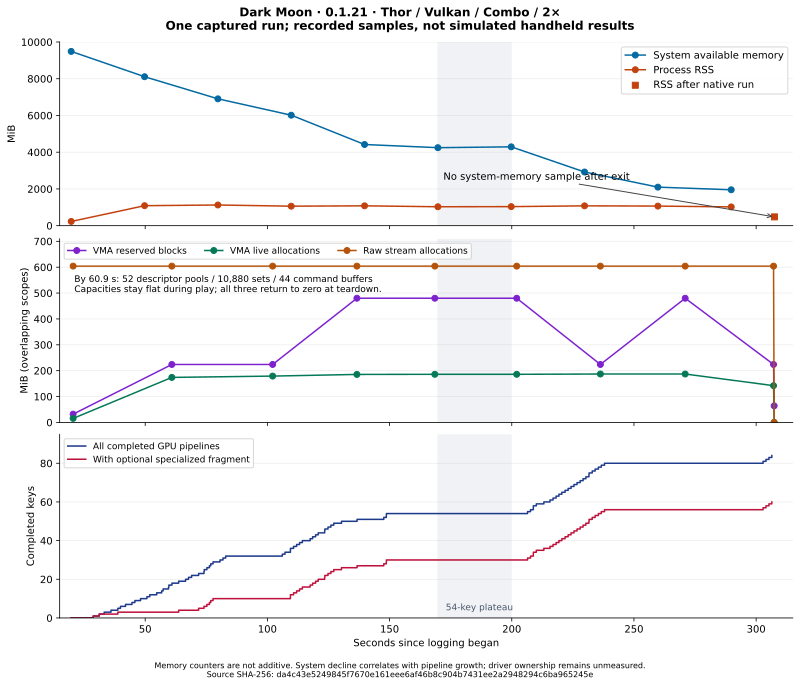

# Dark Moon: 0.1.21 device evidence

<!-- CodexAstraUlt: Analyze the owner's October 6 capture and separate measured behavior, source-proven hazards, and unverified remedies. Raw logs and game footage are not published. -->

The new capture narrows the memory investigation substantially: system available
memory falls by **7,533 MiB**, while the warmed process RSS, native/Java heaps,
tracked Vulkan allocations and resource capacities remain comparatively stable.
Several large declines coincide with additional GPU pipelines using optional
specialized fragment shaders. This prioritizes driver allocation ownership; it
does **not** establish that those pipelines own the missing memory.

The supplied video still shows sharply bounded, changing dark patches on the
green ghost. Source review identifies a quaternion-interpolation parity gap in
lit GPU vertex draws on this Android driver. The selected 0.1.22 correction keeps
those draws on the complete CPU vertex route when neither supported GPU
correction exists. Its effect on this scene and on memory remains untested.

## Capture and scope

<!-- CodexAstraUlt: Preserve the exact source identity without exposing the owner's storage paths. All L references below refer to this uploaded text file. -->

- Source: `uberhar_log_10_6_1540_LSMDM.txt`, 2,144 lines, 692,561 bytes.
- SHA-256: `da4c43e5249845f7670e161eee6af46b8c904b7431ee2a2948294c6ba965245e`.
- Local session anchor: **October 6, 2026, 15:40:35.987757 EDT**; the same instant
  is 19:40:35.987757 UTC (L2). Times below are logged elapsed seconds.
- Build: `e72209ba6d2e8a2140b9058b35731ddb0f381415`, comparison 0.1.21
  (L5, L140). One Dark Moon title session, `0004000000055F00`.
- AYN Thor, QCS8550, Adreno 740, Android API 33; Qualcomm driver 512.676.53,
  Vulkan 1.3.128 (L8–13, L121–123). No cloud benchmark is substituted for this device.
- **Combo / Automatic, mode 3, Vulkan, fixed 2× throughout.** CPU 100%, CPU JIT
  enabled, ready GPU promotion enabled, optional specialized fragments enabled,
  bridge disabled, accurate multiplication enabled, no custom textures
  (L140, L2117; observed setting changes zero).
- Cache files existed, but all three observed generic-module requests missed and
  the driver cache load was missing (L2087). This is observed cold work within a
  directory containing files, not proof that every possible cache was empty.
- There is no Native or mode 4 / Combo Generic control, 4× comparison, or matched
  base-Azahar run in this file. It cannot establish a version-to-version speedup.

The run starts at 20.230 s and ends orderly at 307.374 s: 287.145 s lifetime,
2,489 observed intervals and two frontend pauses totaling 2.891 s (L139, L2001,
L2005, L2077, L2079, L2136). Renderer teardown and `after_native_run` both
complete. This file contains no fatal renderer stop or crash record; that does
not prove the earlier crash condition is fixed.

## Performance and turbo

<!-- CodexAstraUlt: Use the recorded effective limit and shutdown bands; the configured turbo preference does not describe the actual 400% temporary limit. -->

| Disjoint shutdown band | Effective limit | Observed time | Intervals | Achieved speed | Game submissions/s | Largest interval |
| --- | ---: | ---: | ---: | ---: | ---: | ---: |
| Normal | 100% | 6.134 s | 315 | 85.832% | 36.682 | 346.346 ms |
| Fast | 400% temporary | 277.296 s | 2,173 | 13.097% | 7.818 | 1,103.759 ms |

These bands exclude one limit-transition interval (L2121–2122). The configured
turbo preference is 200%, but the actual temporary limit is 400%; reported speed
is achieved emulation speed, not the selected limit. The normal band is too short
and too early to represent the problematic scene. The overall 14.674% average
combines both conditions and must not be reported as normal-speed performance.

As an independent window check, the first stable normal window records 92.330%
over 5.014 s (L176–178). Excluding the entire mixed 100→400 window (L249–251),
55 stable fast windows total 273.430 s at a wall-weighted **12.959%**, ranging
from 7.605% to 25.634%. Of their 2,120 intervals, 1,706 are at least 100 ms,
including one over one second. They therefore show sustained low throughput,
not only a few isolated shader hitches. No scene identity is inferred from turbo.

The renderer records **zero skipped draws**, zero fallback failures and zero
failed optional GPU draw attempts (L2086, L2095). CPU vertex work still takes
44.377 s, about 15.7% of the 283.493 s observed frame interval total; the remainder
cannot be assigned to a specific GPU or driver operation from that host timer
(L2109, L2118). There are 792,087 CPU batches and 456,365 GPU batches, with
736,601 GPU admission attempts (L2114–2115). Optional pipeline driver creation
times below run on a worker and must not be added to frame time as blocked time.

## Memory and pipeline timeline

<!-- CodexAstraUlt: The chart and table publish derived measurements only. Each counter keeps its native ownership scope; no overlapping sums are used. -->

Completed pipeline counts use detail records preceding each health sample;
they are distinct from asynchronously reported admitted/pending counts.

| Health line / seconds | System available MiB | Process RSS MiB | Native heap MiB | Java heap MiB | Completed GPU pipelines | With optional specialized fragment |
| --- | ---: | ---: | ---: | ---: | ---: | ---: |
| L18 / 19.712 | 9,487 | 230.1 | 37.0 | 15.4 | 0 | 0 |
| L419 / 49.746 | 8,109 | 1,087.7 | 352.7 | 16.5 | 10 | 3 |
| L660 / 79.750 | 6,905 | 1,125.8 | 346.3 | 22.4 | 29 | 10 |
| L850 / 109.755 | 6,014 | 1,060.9 | 318.3 | 28.0 | 36 | 12 |
| L1027 / 139.763 | 4,419 | 1,080.7 | 329.3 | 33.7 | 51 | 27 |
| L1200 / 169.771 | 4,246 | 1,030.2 | 313.2 | 14.2 | 54 | 30 |
| L1376 / 199.779 | 4,292 | 1,037.0 | 314.6 | 19.9 | 54 | 30 |
| L1587 / 229.784 | 2,922 | 1,079.6 | 323.7 | 25.6 | 72 | 48 |
| L1773 / 259.788 | 2,098 | 1,066.6 | 305.7 | 31.2 | 80 | 56 |
| L1965 / 289.795 | 1,954 | 1,022.2 | 305.6 | 11.8 | 80 | 56 |

From the first warmed sample to the last, system availability drops **6,155 MiB**
while RSS drops **65.5 MiB**. Sampled RSS stays within 1,022–1,126 MiB after
warmup; the process reports an RSS high-water mark of 1,167.9 MiB. Native heap
stays around 306–353 MiB, and Java heap cycles around 12–34 MiB. Process swap
reaches 31.7 MiB at the last health sample. No sample reports Android's
`low_memory` flag; this flag is not a guarantee of future allocation success.

The plateau from 169.771 to 199.779 s is particularly useful: pipeline count
remains 54 and system availability is nearly flat. The following 30 s adds
18 optional-fragment GPU pipelines and loses 1,370 MiB of system availability,
while RSS increases only 42.6 MiB. The next interval adds eight such pipelines,
loses 824 MiB system-wide, and RSS decreases. The later 80-pipeline plateau
still loses 144 MiB, so the relationship is not exact or exclusive.

| Tracked Vulkan scope | During play | At `after_dependents` teardown |
| --- | --- | --- |
| Raw stream allocations | 604.125 MiB throughout, seven allocation events, zero failures | 0 bytes; all seven freed |
| VMA live allocation bytes | 174.0 MiB at 60.906 s; 187.1 MiB at 270.959 s | 0 bytes / zero live allocations |
| VMA reserved blocks | 224 or 480 MiB after initial warmup; sampled maximum 480 MiB | One empty 64 MiB allocator block remains at this pre-allocator-destruction snapshot |
| Descriptor pools | 52 by 60.906 s, unchanged during play | 0; 52 allocated / 52 freed |
| Descriptor set capacity | 10,880 by 60.906 s, unchanged during play | 0 |
| Command buffer capacity | 44 by 60.906 s, unchanged during play | 0 |
| Cached current-minus-completed GPU ticks | 13–29 in periodic warmed samples; both ticks advance | Gap 1 before dependent teardown; unavailable afterwards |

Evidence: L146, L518, L776, L1000, L1199, L1399, L1627, L1840, L2085,
L2107. Cached tick differences measure neither milliseconds nor exact queue
depth; these samples do not show monotonically growing retirement backlog.
Capacity free-batch counters aggregate owner releases, so differing allocation
and free **batch event** counts do not contradict the zero remaining capacities.

At 307.487 s, process RSS is **479.1 MiB**, down from the warmed level but above
the 231.0 MiB immediate pre-run sample (L22, L2140). There is **no system
available-memory sample after exit**. One lifecycle is insufficient to establish
a bounded baseline across repeated title launches, or recovery of the missing
system memory. The partial-allocation fix and resource-pool change in 0.1.21
must not be credited with resolving the old failure solely from this orderly exit.

These measurements exclude driver-internal allocation ownership and cannot
account for every GPU/kernel/shared allocation or unrelated process. RSS,
native/Java heaps, VMA and raw Vulkan counters overlap and are not additive.
The explicit scopes narrow the search away from growing live image/stream
allocations or ever-growing observed pool capacities, but do not identify an
owner for the multi-GiB system decline.

## Pipeline cost and state coverage

<!-- CodexAstraUlt: Count completed identities rather than repeated progress totals; driver creation time is neither shader stage timing nor resident bytes. -->

All 84 completed GPU pipeline detail records are present, ordinals 1–84,
between L247 and L2078. They represent **84 distinct VS/FS pairs**, 23 vertex
shader identities and 65 fragment identities; all succeeded. Each uses stage
mask 3 (vertex + fragment), topology 3, two bindings and 16 attributes. The
logged attachment combinations occur 71, six and seven times. These coarse
fields do not expose the full vertex layout or complete pipeline state.

| Completed GPU pipeline group | Count | Driver creation total | Median | Maximum |
| --- | ---: | ---: | ---: | ---: |
| All | 84 | 117.098 s | 1.188 s | 3.178 s |
| Optional specialized fragment | 60 | 78.603 s | 1.190 s | 3.178 s |
| Nonoptional fragment path | 24 | 38.495 s | 1.175 s | 2.820 s |
| First observed pipeline for a VS identity | 23 | 56.142 s | 2.593 s | 3.178 s |
| Further pipelines reusing a VS identity | 61 | 60.956 s | 1.159 s | 1.324 s |

The first encounter of a VS tends to cost more, but substantial creation work
continues for additional fragment combinations. Neither group isolates the
driver's VS compiler, FS compiler or linking stages. `specialized_optional=false`
does not mean that every corresponding fragment is generic; mandatory recovery
for unsupported generic state remains possible.

The application compiles 75 optional fragment modules in only 453.438 ms total
(maximum 9.671 ms), while the 84 GPU pipeline creations take 117.098 s (L2099,
L2086). This locates a large cost after source/module generation, without proving
how much running frames wait or how many bytes the driver retains. The separate
mandatory specialized and compact-fallback pipeline groups each build 20
pipelines, with driver totals 830.225 ms and 389.466 ms respectively
(L2103–2104).

Generic-state recovery remains significant: 18,523 SPIR-V-incompatible and
135,714 shadow2D draw classifications, with the other logged recovery reasons
zero (L2092). These are route counts, not proof that shadow sampling caused the
visible defect. The previous input guards all remain zero: zero stride, short
stride, default attribute and register alias (L2082).

## Visual evidence and the next correction

<!-- CodexAstraUlt: Distinguish visible corruption from the independently established interpolation contract; neither a screenshot nor source inspection proves a device fix. -->

The separately supplied 15.747 s, 1920×1080 capture (57/4 nominal capture fps)
shows changing, sharply triangular dark patches across the green ghost's face
and body. Its silhouette remains recognizable, while the professor and much of
the background remain comparatively intact. The overlay shows roughly 7 FPS /
12% during the defect. Capture frame rate is not emulation speed. Exact video
alignment with log time has not been verified; no pipeline key is assigned to a
particular visible triangle, and the footage is not committed.

The source-proven hazard is specific: the CPU triangle path aligns vertex
quaternion signs to the first triangle vertex before interpolation
([`RasterizerAccelerated::AddTriangle`](../src/video_core/rasterizer_accelerated.cpp)).
Android deliberately disables geometry shaders
([`Instance::UseGeometryShaders`](../src/video_core/renderer_vulkan/vk_instance.h)),
and this device reports `VK_KHR_fragment_shader_barycentric` unavailable (L118).
The GPU path therefore lacks the corresponding cross-vertex sign correction
for lit draws. The no-geometry shader generator writes its vertex quaternion
directly; see [`CalcExtraConfig`](../src/video_core/renderer_vulkan/vk_pipeline_cache.cpp)
and [`glsl_shader_gen.cpp`](../src/video_core/shader/generator/glsl_shader_gen.cpp).
Interpolating opposite signs can produce discontinuous lighting even though
the represented endpoint rotations agree.

The selected 0.1.22 change requires a valid GPU quaternion-correction capability
before promoting lit draws; otherwise it executes the full CPU vertex draw.
Unlit eligible draws remain candidates for GPU promotion. This restores a
required state contract and may reduce promoted draws and performance. It is
**not yet a demonstrated cure** for the recorded ghost artifact or memory loss.
Both mode 3 and mode 4 must honor that contract.

The memory follow-up is bounded, optional KGSL/process GPU accounting where
readable, plus system-memory snapshots around native-run teardown. Unavailable
vendor counters must remain `unknown`, with no permission requirement for play.
The next comparison should be brief, matched openings at 2× using Native,
corrected Combo and Combo Generic, followed by a clean exit: compare the image,
selected/deferred/lit-fallback counts, pipeline growth and memory recovery.
Mode 4 can promote different draws because optional FS readiness no longer
blocks it; a percentage-only mode comparison is insufficient. A long crash
reproduction or full game suite is not needed before that diagnosis.

## Logging and limits

<!-- CodexAstraUlt: Account for explicit diagnostic omissions and avoid claiming an overhead measurement from record volume. -->

The file reports 24 omitted optional diagnostic records across 22 omission
reports, each classified `queue_full_or_contended`. This does not distinguish a
full queue from brief lock contention. Lifecycle totals are present and all 84
pipeline detail records are accounted for, but sparse periodic samples cannot
exclude brief peaks. The three applet-utility requests produce three records;
there is no repeated applet-warning flood in this run (L2137–2138).

The log is approximately 676 KiB. Its size and completed teardown demonstrate
neither zero logging overhead nor a performance regression caused by logging.
No host-only test reproduces the device image or proves a Thor/Retroid speed
target. Renderer correctness, sustained 2×/4× headroom, warm memory plateaus and
bounded memory after repeated title cycles remain device acceptance gates.
