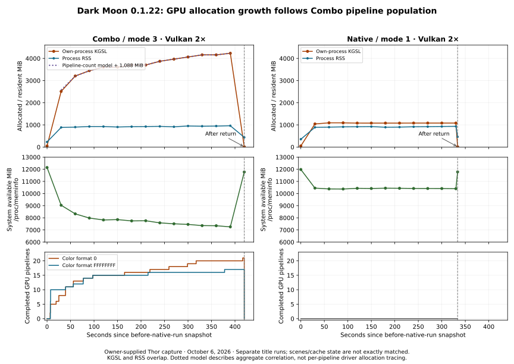

# Dark Moon: 0.1.22 device evidence

<!-- CodexAstraUlt: Analyze the owner's October 6 capture using newly available own-process GPU counters and two title lifecycles. Publish derived evidence only. -->

Combo still accumulates several GiB of GPU-accounted memory during play. The new
Qualcomm counters locate that growth in Uberhar's own process, and it closely
follows the number of retained GPU pipelines. Native stays near a stable GPU
allocation baseline. Both runs release almost all recorded GPU allocations when
the game returns normally to the menu.

This is stronger evidence than the previous system-wide decline: the excessive
resources belong to Uberhar's GPU allocation scope during Combo. It does not yet
identify their internal driver type or show a leak persisting across title exits.
The owner reports that ghost glitches persist and the moon also glitches, while
performance feels substantially better than the prior build. The renderer is
therefore not visually corrected; this turn supplies no new image to classify the
moon artifact or tie it to a pipeline.

## Capture and settings

<!-- CodexAstraUlt: Preserve exact build and phase context without publishing the owner's storage paths or raw log. Line numbers refer to the uploaded file. -->

- `uberhar_log_10_6_1936_LSMDM.txt`: 5,301 lines, 1,754,807 bytes.
- SHA-256: `f0c2626d6d75204a80f1d0862098ed599921a3349fb21bc673e34e274fabd427`.
- Session anchor: **October 6, 2026, 19:36:26.502085 EDT** (L2).
- Build `d742cd5e9e90b7ba3f67367460ef2c7d3f27b5bc`, version 0.1.22 (L5, L140).
- AYN Thor, QCS8550, Adreno 740, Android API 33, Vulkan; one process, PID 1672.
- Two Dark Moon sessions, title `0004000000055F00`: **Combo / Automatic, mode 3**
  first; **Native, mode 1** second. Both fixed **2×**, CPU 100%, JIT and accurate
  multiplication enabled, bridge disabled, no custom textures, with no observed
  settings changes during either session (L140, L2924, L3073, L5275).
- Both complete renderer teardown and `after_native_run`. The file contains no
  fatal renderer stop, device-lost record, or crash record.

Combo encounters three generic-module misses; Native starts second and encounters
three hits. Both supply a driver cache to the driver, whose internal hit rate is
unknown (L2894, L5245). The runs are a useful same-build mode comparison, but their
scene progression and cache state are not exactly matched. There is no 4× or
base-Azahar control. The owner confirms visible defects in both ghosts and the
moon; no new image or video accompanies this log to identify their exact form.

## Performance and route selection

<!-- CodexAstraUlt: Report shutdown bands that exclude temporary acceleration and transition intervals. -->

| Normal-speed band | Observed time | Intervals | Achieved speed | Game submissions/s | Largest interval |
| --- | ---: | ---: | ---: | ---: | ---: |
| Combo 2× (L2928) | 416.302 s | 5,495 | **22.061%** | 12.967 | 228.780 ms |
| Native 2× (L5279) | 329.216 s | 5,725 | **29.065%** | 17.116 | 216.411 ms |

Combo stays at the 100% limit throughout. Native's separate stable 400% turbo
band is 2.255 s / 43 intervals / 31.870% achieved; two transition intervals are
excluded from both bands (L5280). Combo's lifecycle lasts 419.148 s with one
2.461 s frontend pause; Native lasts 333.175 s with one 1.284 s pause
(L2942, L5294). These results remain far below the playback target. They do not
establish a speedup from 0.1.21, whose normal band was only 6.134 s and whose
long problematic section was accelerated. The owner reports a substantial
subjective improvement, but these different runs do not quantify a matched
version-to-version speedup.

The quaternion guard executes **1,464,239 CPU fallbacks** in Combo (L2889).
The other four input guards remain zero. Combo records 2,646,551 CPU batches and
552,853 GPU batches from 2,061,500 GPU admission attempts. Native records
3,416,357 CPU batches and zero GPU attempts (L2920, L5271). Neither session
records skipped draws, failed optional GPU attempts, key mismatches or generic
fallback failures. These counters establish route behavior, not image parity.

CPU vertex-stage time is 230.434 s in Combo, approximately 55.4% of observed frame
time, and 259.995 s in Native, approximately 78.4% of its observed time including
the brief turbo section (L2916, L5267). The timers are host wall time; they neither
measure GPU execution nor assign all remaining frame time to the driver. Native's
CPU throughput remains a separate architectural issue from excessive GPU memory.

## Memory ownership and recovery

<!-- CodexAstraUlt: Keep counter scopes separate and use the same system-memory source throughout this capture. -->

All table values are MiB. KGSL is the kernel-tracked own-process GPU allocation
scope; its CPU-mapped subset, process RSS, VMA and raw Vulkan allocations overlap
and must not be added. System availability below uses `/proc/meminfo` consistently.
The existing Android `available_mem_mib` differs substantially: at L18 it reports
3,355 MiB while `/proc/meminfo` reports 12,157.8 MiB. Its source is Android's
`MemoryInfo.availMem`; no conversion bug has been established. Keep that source
distinction explicit and do not retroactively replace readings in older captures.

| Line / seconds | Run / event | System available | Process RSS | Own-process KGSL | Completed GPU pipelines |
| --- | --- | ---: | ---: | ---: | ---: |
| L22 / 8.946 | Combo before | 12,142.7 | 230.2 | 50.3 | 0 |
| L407 / 38.949 | Combo | 9,034.8 | 885.7 | 2,511.0 | 18 |
| L620 / 68.954 | Combo | 8,324.7 | 900.5 | 3,206.2 | 25 |
| L794 / 98.961 | Combo | 7,980.4 | 926.9 | 3,446.7 | 28 |
| L996 / 128.970 | Combo | 7,822.8 | 926.1 | 3,605.8 | 30 |
| L1166 / 158.974 | Combo | 7,852.1 | 904.2 | 3,605.8 | 30 |
| L1367 / 188.979 | Combo | 7,745.0 | 920.1 | 3,701.9 | 31 |
| L1567 / 218.984 | Combo | 7,757.8 | 925.5 | 3,701.9 | 31 |
| L1740 / 248.989 | Combo | 7,583.2 | 932.9 | 3,871.1 | 33 |
| L1940 / 278.995 | Combo | 7,506.9 | 913.9 | 3,967.2 | 34 |
| L2141 / 308.998 | Combo | 7,457.4 | 950.7 | 4,063.5 | 35 |
| L2342 / 339.003 | Combo | 7,357.4 | 940.2 | 4,160.1 | 36 |
| L2512 / 369.009 | Combo | 7,346.9 | 947.8 | 4,160.0 | 36 |
| L2713 / 399.014 | Combo last health | 7,254.3 | 961.0 | 4,232.1 | 37 |
| L2946 / 428.664 | Combo after return | 11,775.6 | 438.4 | **12.2** | 38 built before teardown |
| L2958 / 445.575 | Native before | 11,980.4 | 354.1 | 51.5 | 0 |
| L3299 / 475.577 | Native | 10,448.3 | 890.5 | 1,043.6 | 0 |
| L3496 / 505.581 | Native | 10,379.1 | 899.4 | 1,093.3 | 0 |
| L3875 / 565.589 | Native | 10,430.4 | 916.7 | 1,081.7 | 0 |
| L4263 / 625.596 | Native | 10,442.1 | 895.4 | 1,081.1 | 0 |
| L4639 / 685.606 | Native | 10,418.5 | 914.8 | 1,083.0 | 0 |
| L5210 / 775.617 | Native last health | 10,398.4 | 933.7 | 1,082.8 | 0 |
| L5298 / 779.210 | Native after return | 11,782.9 | 462.3 | **15.1** | 0 |

Combo's pre-run to last-health system decline is **4,888.4 MiB**; its own-process
KGSL scope grows **4,181.9 MiB**. From the first warmed sample to the last, RSS
grows only 75.3 MiB while KGSL grows 1,721.2 MiB. Native's warmed KGSL readings
settle around 1,081–1,093 MiB and system availability remains near 10.4 GiB.

After Combo exits, system availability recovers 4,521.3 MiB from the last health
sample, leaving it 367.2 MiB below the immediate pre-run value; it recovers a
further 204.9 MiB before Native starts. Both after-return KGSL readings are below
their respective pre-run values. RSS remains above the initial application
baseline, and two lifecycles do not establish indefinite stability. Nevertheless,
the multi-GiB GPU allocation population is released on these normal exits.

## Pipeline population explains the growth pattern

<!-- CodexAstraUlt: An aggregate allocation model narrows the source investigation without pretending that KGSL exposes individual driver allocations. -->

At 30 pipelines, KGSL changes by just 0.035 MiB over 30 seconds; at 31 pipelines,
another 30-second plateau also changes it by 0.035 MiB. The successive increases
from 34 to 35 to 36 pipelines add 96.281 and 96.598 MiB. The 36-pipeline plateau
then changes by -0.098 MiB. Pipeline 37 adds 72.141 MiB.

The detail records divide into two attachment groups, both with depth format 17.
The following model accounts for the full late-run population particularly well:

| GPU pipeline attachment group | Count at last health | Approximate contribution per pipeline | Modeled contribution |
| --- | ---: | ---: | ---: |
| Color format 0 | 20 | 96 MiB | 1,920 MiB |
| Color format `FFFFFFFF` | 17 | 72 MiB | 1,224 MiB |
| Combined | 37 | — | **3,144 MiB** |

Subtracting `96 × color-format-0 count + 72 × color-format-FFFFFFFF count` from
the measured KGSL value leaves **1,085.8–1,088.1 MiB at every health snapshot
from 128.970 through 399.014 s**. That residual closely resembles Native's GPU
baseline. Earlier warmed snapshots at 68.954 and 98.961 s leave about 1,094 MiB.
This is an aggregate correlation model, not direct attribution of a driver's
scratch buffer or other allocation to one pipeline. It motivates inspecting
pipeline creation, shader optimization and retained driver resources before
changing unrelated texture, logging or CPU resource ownership.

All **38** GPU completion records are present and successful; the last completes
after the last health sample. They describe 14 vertex identities, 30 fragment
identities and 37 distinct VS/FS pairs; one pair has two distinct pipeline keys.
All use stage mask 3, no geometry shader, topology 3, two bindings and 16 attributes.
There are **31 optional-specialized-fragment pipelines** using 25 fragment
identities, and **seven other pipelines** using five fragment identities. The
latter can include mandatory specialized recovery; `specialized_optional=false`
does not mean that the fragment is necessarily generic.

GPU pipeline creation totals 5.617490 s, median 6.772 ms, maximum 927.238 ms.
Small cached creation time does not imply small resident memory. Combo compiles
25 optional fragment modules in 71.801 ms. Both runs build 20 mandatory
specialized and 21 compact-fallback pipelines, with driver totals of only a few
tens of milliseconds (L2906, L2910–2911, L5261–5262). These worker timings are
not frame-blocking durations and are not resident byte counts.

## Explicit resource scopes and diagnostic limits

<!-- CodexAstraUlt: Verify that the new ownership evidence is not mistaken for growth in already bounded application allocations. -->

| Scope | Combo during play | Native during play | After dependent teardown, both runs |
| --- | --- | --- | --- |
| Raw streams | 604.125 MiB, seven allocations, no failures | Same | Zero; seven frees |
| VMA reserved blocks | 224 MiB after warmup | 224 MiB after warmup | One empty 64 MiB block before allocator destruction |
| VMA live bytes, periodic warmed samples | 145.7–186.0 MiB | 119.2–182.0 MiB | Zero |
| Descriptor pools / set capacity | 32 / 5,888 | Mostly 16 / 2,048; peak 17 / 2,304 | Zero |
| Command buffer capacity | 32 → 36 | 20 → 24 | Zero |

Periodic warmed Combo tick gaps are 5–23 with both cached ticks advancing; they
measure neither milliseconds nor an exact queue depth. No steadily expanding
retirement backlog is demonstrated. Evidence: L442–L2780, L2914, L3334–L5168,
L5265. These explicit scopes do not grow by the several GiB seen in KGSL.

Generic recovery remains similar: Combo classifies 21,041 SPIR-V-incompatible
and 154,067 shadow2D draws; Native classifies 20,920 and 153,198 (L2899, L5250).
Those are route counts, not image fault attribution. Missing certificate,
filesystem timing defaults and absent extra save-slot messages occur in both
runs; the completed lifecycles contain no fatal failure.

There are 66 omitted optional records across 55 omission reports: Combo 42 across
37 reports, Native 24 across 18. All say `queue_full_or_contended`, which does not
distinguish queue capacity from lock contention. Final totals and all 38 pipeline
details are present. Log size and omission counts do not establish logging cost.

The next implementation should target excessive retained GPU resources while
preserving exact draws and the quaternion guard. A 256-pipeline cap alone is not
a useful byte bound at these observed increments. Any containment must preserve
in-flight pipeline lifetimes and avoid compile/evict churn; reducing a cap alone
does not explain or remove the per-pipeline cost. Device acceptance remains
bounded memory as new scene states appear, correct images and useful throughput,
then normal exit/relaunch recovery. The existing diagnostic cadence now provides
the necessary first ownership evidence without an additional logging service.
